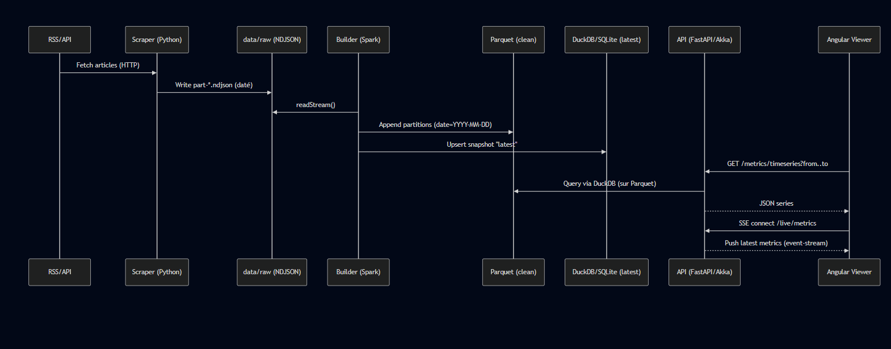

# CryptoViz

##  Objectif du projet
CryptoViz est une plateforme d’analyse et de visualisation en temps réel des actualités crypto.  
Le but est de construire une pipeline **de bout en bout** qui va :
1. **Scraper** des flux RSS (news crypto) → fichiers NDJSON bruts.
2. **Builder (Scala + Spark)** → nettoyer et normaliser les données → stockage en Parquet.
3. **API (FastAPI + DuckDB)** → servir les métriques et agrégations via endpoints REST.
4. **Viewer (Angular)** → afficher graphiques dynamiques avec auto-refresh.

 L’objectif pédagogique est double :
- Montrer comment mettre en place une **data pipeline moderne** avec stockage brut, ETL, API et front.
- Former l’équipe à des **pratiques DevOps & data engineering** (Docker, CI/CD, monitoring).

---

##  Architecture technique

### Diagramme (Mermaid)

data/raw/ : stockage brut (NDJSON, partitionné par date).

data/clean/parquet/ : données normalisées, colonnes typées, partitionnées.

data/state/ : fichiers DuckDB pour snapshots rapides (latest.duckdb).

- **data/raw/** : stockage brut (NDJSON, partitionné par date).
- **data/clean/parquet/** : données normalisées, colonnes typées, partitionnées.
- **data/state/** : fichiers DuckDB pour snapshots rapides (`latest.duckdb`).

---

##  Prérequis

- **Docker** ≥ 20
- **Docker Compose** ≥ 1.29
- **GNU Make** (Linux/Mac : par défaut, Windows : via WSL)
- **Java 11+** → compilation projet Scala
- **sbt** → builder Scala
- **Node.js 20+** + **pnpm** → viewer Angular
- **Python 3.11+** + **pip** → scraper + API

---

##  Commandes Makefile

- `make bootstrap` → crée l’arborescence `data/`, installe dépendances, génère images Docker.
- `make up` → lance l’ensemble des services (scraper, builder, api, viewer).
- `make down` → stoppe tous les conteneurs.
- `make logs service=api` → affiche logs d’un service.
- `make reset-data` → nettoie `data/raw`, `data/clean`, `chk/`, `logs`.
- `make demo` → recharge dataset de démo figé pour présentation offline.

---

##  Runbooks

### Scraper (Python)
- Config `.env` avec `RSS_SOURCES` et intervalle.
- Écrit NDJSON dans `data/raw/YYYY/MM/DD/part-*.ndjson`.
- Endpoint `/health` expose `last_write_at`.
- Logs JSON homogènes.

### Builder (Scala + Spark)
- Compile avec `sbt package` → produit `target/scala-2.12/builder_2.12-0.1.jar`.
- Exécuté par Spark via `spark-submit`.
- Lit `data/raw/**` → écrit `data/clean/parquet/**` (partition par date).
- Checkpoint → `chk/clean`.

### API (FastAPI + DuckDB)
- Endpoints :
    - `/health`
    - `/metrics/timeseries`
    - `/metrics/top`
    - `/metrics/latest`
- DuckDB lit Parquet directement, + fichier d’état `latest.duckdb`.
- Logs JSON + Prometheus `/metrics`.

### Viewer (Angular)
- Lance `pnpm install && pnpm start`.
- Dev server → `http://localhost:4200`.
- Auto-refresh toutes les 10s.
- Graphes : timeseries, top sources, trending (plus tard).

---

##  Résultat attendu

En suivant ce README, un nouveau développeur doit :
1. Cloner le repo
2. Lancer `make bootstrap && make up`
3. Aller sur `http://localhost:4200`
4. Voir une première courbe alimentée par les flux RSS

## Env

Le .env du projet est unique et se trouve à la racine de ce dernier, un .env.exemple est disponible avec
l'ensemble des var à fournir afin d'avoir un projet fonctionnement correctement.

### Particularité d'Angular

  Angular ne proposant pas nativement de solution pur les variable d'environnement, un script va aller chercher les variable
  souhaitez depuis le *.env*, ces dernières sont stipulés dans *web/set-env.js*, si il vous faut ajouter
  des variables dans le projet angular ça sera par ici.
  
### Docker

  Pour le docker les variable sont simplement récupérées
  
### Python

  Pour les variables d'env, python va les récupérer grâve à la lib : *python-dotenv* grace à un chemin littéral
  spécifié dans le main.py du *scraper/*